# Intelligent Routing & Coordination

This document explains how Solar System Agents intelligently routes tasks and coordinates multi-planet workflows.

## The Sun's Decision Process

### 1. Task Analysis Pipeline

When a task arrives, the Sun executes a sophisticated analysis pipeline:


### 2. Gravitational Pull Calculation

Each task generates a gravitational field that pulls toward appropriate planets:

```mermaid
graph LR
    T[Task: Build FastAPI with OAuth2] --> |Strong Pull| M[♂ Mars]
    T --> |Strong Pull| U[♅ Uranus]
    T --> |Medium Pull| E[🌍 Earth]
    T --> |Weak Pull| J[♃ Jupiter]

    M --> |backend-architect| R1[Route 1]
    U --> |security-auditor| R2[Route 2]
    E --> |test-automator| R3[Route 3]
    J --> |deployment-engineer| R4[Route 4]

    R1 & R2 & R3 & R4 --> O[Orchestrated Execution]
```

### 3. Complexity-to-Distance Mapping

The Sun routes based on complexity, mapping to appropriate orbital distances:


## Multi-Planet Orchestration Patterns

### Pattern 1: Sequential Workflow (Orbital Train)

Planets execute in sequence, each building on the previous:


### Pattern 2: Parallel Execution (Planetary Alignment)

Independent workstreams execute simultaneously:

```mermaid
graph TD
    S[☀️ Sun Orchestrator] --> P{Parallel Branches}

    P --> B1[Branch 1: Backend]
    P --> B2[Branch 2: Frontend]
    P --> B3[Branch 3: Infrastructure]

    B1 --> M1[♂ Mars: API Development]
    B1 --> SA1[♄ Saturn: Database Schema]

    B2 --> V1[♀ Venus: UI Components]
    B2 --> V2[♀ Venus: Mobile App]

    B3 --> J1[♃ Jupiter: K8s Setup]
    B3 --> J2[♃ Jupiter: CI/CD Pipeline]

    M1 & SA1 --> I1[Integration Point 1]
    V1 & V2 --> I2[Integration Point 2]
    J1 & J2 --> I3[Integration Point 3]

    I1 & I2 & I3 --> E[🌍 Earth: Final Integration & Testing]
    E --> N[♆ Neptune: Monitoring]
```

### Pattern 3: Feedback Loop (Orbital Resonance)

Planets work in iterative cycles, improving with each orbit:

```mermaid
graph TD
    S[☀️ Sun] --> E1[🌍 Earth: TDD Red]
    E1 --> M1[♂ Mars: Implement]
    M1 --> E2[🌍 Earth: TDD Green]
    E2 --> E3{Tests Pass?}

    E3 -->|No| M1
    E3 -->|Yes| E4[🌍 Earth: Refactor]

    E4 --> N1[♆ Neptune: Performance Check]
    N1 --> N2{Performance OK?}

    N2 -->|No| M2[♂ Mars: Optimize]
    M2 --> N1
    N2 -->|Yes| U1[♅ Uranus: Security Scan]

    U1 --> U2{Secure?}
    U2 -->|No| M3[♂ Mars: Fix Vulnerabilities]
    M3 --> U1
    U2 -->|Yes| Done[✅ Complete]
```

### Pattern 4: Gravitational Assist (Cross-Planet Learning)

One planet uses another's expertise to accelerate:

```mermaid
graph LR
    V[♀ Venus: Frontend Performance Issue] --> N[♆ Neptune: Performance Analysis]
    N --> |Insight: Backend slow| M[♂ Mars: API Optimization]
    M --> |Optimized API| V
    V --> |Back with solution| UI[Improved UI Performance]

    style N fill:#4A90E2,color:#fff
    style M fill:#E24A4A,color:#fff
    style V fill:#E2B04A,color:#fff
```

## Intelligent Decision Examples

### Example 1: Ambiguous Task Resolution

**Task:** "Improve application performance"

```mermaid
graph TD
    T[Task: Improve Performance] --> S[☀️ Sun Analyzes]

    S --> Q1{Where is bottleneck?}
    Q1 -->|Unknown| S1[Multi-Planet Investigation]

    S1 --> N[♆ Neptune: Profile System]
    N --> R{Bottleneck Found}

    R -->|Frontend| V[♀ Venus: Optimize UI]
    R -->|Backend| M[♂ Mars: Optimize API]
    R -->|Database| SA[♄ Saturn: Optimize Queries]
    R -->|Infrastructure| J[♃ Jupiter: Scale Resources]

    V --> E[🌍 Earth: Validate Improvement]
    M --> E
    SA --> E
    J --> E
```

### Example 2: Escalation & De-Escalation

The Sun dynamically adjusts planet assignment based on actual complexity:


### Example 3: Context-Aware Routing

Same keywords, different routes based on context:

```mermaid
graph TD
    K[Keyword: API] --> C{Context Analysis}

    C -->|Context: Design| M1[♂ Mars: backend-architect]
    C -->|Context: Security| U[♅ Uranus: security-auditor]
    C -->|Context: Performance| N[♆ Neptune: performance-engineer]
    C -->|Context: Documentation| A[☄️ Asteroid Belt: api-documenter]
    C -->|Context: Testing| E[🌍 Earth: test-automator]

    M1 --> |Design API| O1[Outcome 1]
    U --> |Secure API| O2[Outcome 2]
    N --> |Optimize API| O3[Outcome 3]
    A --> |Document API| O4[Outcome 4]
    E --> |Test API| O5[Outcome 5]
```

## Coordination Intelligence

### 1. Dependency Resolution

The Sun automatically detects and orders dependencies:


### 2. Parallel Opportunity Detection

The Sun identifies tasks that can run in parallel:

```mermaid
graph LR
    S[☀️ Sun] --> A[Analyze Dependencies]

    A --> P1[Parallel Group 1]
    A --> P2[Parallel Group 2]
    A --> P3[Parallel Group 3]

    P1 --> |No Dependencies| E1[Execute Simultaneously]
    P1 --> T1[♂ Mars: API]
    P1 --> T2[♀ Venus: UI Mock]
    P1 --> T3[☄️ Docs: API Spec]

    E1 --> |Wait for completion| P2

    P2 --> T4[🌍 Earth: Integration Tests]
    P2 --> T5[♅ Uranus: Security Scan]

    P2 --> E2[Execute Simultaneously]
    E2 --> |Wait for completion| P3

    P3 --> T6[♃ Jupiter: Deploy]
    T6 --> T7[♆ Neptune: Monitor]
```

### 3. Resource Optimization

The Sun balances workload across planets:

```mermaid
graph TD
    S[☀️ Sun: Task Queue] --> M{Load Balancing}

    M --> C1[Check Planet Capacity]
    C1 --> P1[♂ Mars: 60% loaded]
    C1 --> P2[♀ Venus: 30% loaded]
    C1 --> P3[♄ Saturn: 90% loaded]

    M --> T1[Backend Task]
    M --> T2[Frontend Task]
    M --> T3[Data Task]

    P1 & T1 --> D1{Mars available?}
    D1 -->|Yes| A1[Assign to Mars]
    D1 -->|Overloaded| A2[Queue or Find Alternative]

    P2 & T2 --> D2{Venus available?}
    D2 -->|Yes| A3[Assign to Venus]

    P3 & T3 --> D3{Saturn available?}
    D3 -->|Overloaded| A4[Wait or Scale]
```

### 4. Failure Recovery

Intelligent fallback and retry strategies:


## Learning & Adaptation

### Pattern Recognition

The Sun learns which routing patterns succeed:


### Adaptive Routing

Routes improve over time based on outcomes:


## Advanced Coordination Techniques

### Gravitational Lensing

Using one planet to bend the path to discover better solutions:

```mermaid
graph LR
    Start[Task: Optimize UI] --> Direct[Direct: Venus]
    Start --> Lens[Lensed: Venus → Saturn → Venus]

    Direct --> D1[Standard UI Optimization]
    Lens --> L1[♀ Venus: Identify bottleneck]
    L1 --> L2[♄ Saturn: Analyze user data]
    L2 --> L3[♄ Saturn: Find usage patterns]
    L3 --> L4[♀ Venus: Data-driven UI optimization]

    D1 --> R1[Result: 20% faster]
    L4 --> R2[Result: 50% faster + better UX]

    style R2 fill:#00ff00,color:#000
```

### Planetary Alignment

Special configurations for optimal outcomes:

```
Alignment: ♂ Mars - ♀ Venus - ♃ Jupiter
Effect: Perfect full-stack deployment window
Benefit: API + UI + Infrastructure deploy atomically
```

```mermaid
graph TD
    S[☀️ Detect Alignment Opportunity] --> A{Alignment Type}

    A -->|Mars-Venus-Jupiter| MVJ[Full-Stack Deploy]
    A -->|Saturn-Jupiter-Neptune| SJN[ML Model Deploy + Monitor]
    A -->|Uranus-Mars-Jupiter| UMJ[Secure Infrastructure Deploy]

    MVJ --> Sync[Synchronized Execution]
    SJN --> Sync
    UMJ --> Sync

    Sync --> Atomic[Atomic Multi-Planet Operation]
```

## Metrics & Observability

The system monitors its own intelligence:

```mermaid
graph TD
    M[Metrics Collection] --> M1[Routing Accuracy: 97%]
    M --> M2[Coordination Efficiency: 89%]
    M --> M3[Token Efficiency: 0.7x baseline]
    M --> M4[User Satisfaction: 94%]
    M --> M5[Emergence Score: 45%]

    M1 & M2 & M3 & M4 & M5 --> Dashboard[Intelligence Dashboard]

    Dashboard --> Feedback[Continuous Improvement]
    Feedback --> S[☀️ Sun Routing Updates]
    Feedback --> P[Planet Coordination Updates]
```

---

**The intelligence is in the coordination, not just the agents.**
