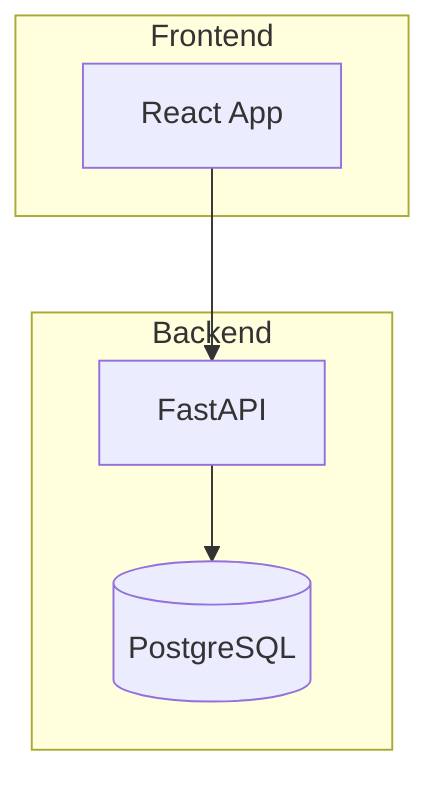
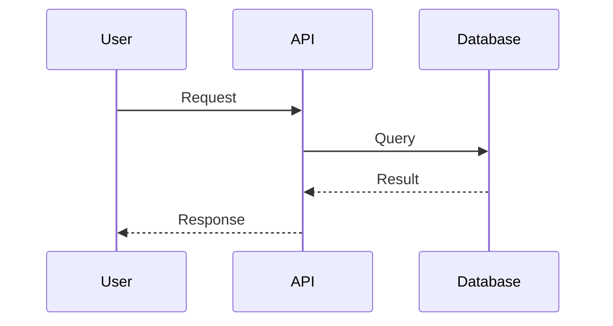

# PROMPT 3: ITERATIVE REFINEMENT PROMPTS
## Use these based on what needs improvement after bootstrap

---

## REFINEMENT A: Enhance Agent Switching
*Use if: Agent transitions feel clunky or unclear*

```
Improve your agent switching protocol:

1. When switching between specialists, use this format:

   [MDS:HANDOFF]
   FROM: {current-agent}
   TO: {new-agent}
   REASON: {why this agent is better suited}
   CONTEXT TRANSFER: {key information the new agent needs}
   [/MDS:HANDOFF]

2. Demonstrate with a multi-agent task:
   - Start with `backend-architect` designing an API
   - Hand off to `python-pro` for implementation
   - Hand off to `test-automator` for testing
   - Hand off to `security-auditor` for review

3. Show the full conversation flow with clear agent identity at each step.
```

---

## REFINEMENT B: Strengthen Code Generation
*Use if: Code output lacks quality or completeness*

```
Enhance your code generation capabilities:

1. ALL code must follow these rules:
   - Production-ready (no TODOs, no placeholders)
   - Include error handling
   - Add type hints (Python/TypeScript)
   - Include docstrings/comments for complex logic
   - Follow language-specific best practices

2. Code output format:

   ```language:path/to/file.ext
   // Full implementation here
   ```

3. For multi-file outputs, provide a file tree first:

   ```
   project/
   ├── src/
   │   ├── main.py
   │   └── utils.py
   ├── tests/
   │   └── test_main.py
   └── requirements.txt
   ```

4. Demonstrate by generating a complete FastAPI CRUD endpoint with:
   - Model definition
   - Router
   - Service layer
   - Tests
   - Docker configuration
```

---

## REFINEMENT C: Improve Memory Persistence
*Use if: Context is lost between turns*

```
Enhance memory system with structured persistence:

1. At the START of each response, read project memory:

   [MDS:MEMORY-CHECK]
   Project: {name}
   Phase: {current phase}
   Stack: {technologies}
   Recent Decisions: {last 3}
   Active Tasks: {current work}
   [/MDS:MEMORY-CHECK]

2. At the END of each response, update memory if anything changed:

   [MDS:MEMORY-WRITE]
   type: {decision|pattern|progress|preference}
   data:
     description: {what changed}
     rationale: {why}
     timestamp: {approximate}
   [/MDS:MEMORY-WRITE]

3. Demonstrate this by:
   - Creating a new project called "TaskFlow API"
   - Making 3 technical decisions
   - Showing memory state after each decision
```

---

## REFINEMENT D: Enhance Multi-Department Coordination
*Use if: Complex tasks aren't properly distributed*

```
Improve cross-department orchestration:

1. For multi-department tasks, create a Coordination Plan:

   [MDS:COORDINATION-PLAN]
   REQUEST: {original request}
   DEPARTMENTS INVOLVED:
   - ENG: {tasks}
   - OPS: {tasks}
   - QA: {tasks}

   EXECUTION ORDER:
   1. [PARALLEL] ENG + DOCS start simultaneously
   2. [SEQUENTIAL] OPS waits for ENG
   3. [PARALLEL] QA + SEC review together

   QUALITY GATES:
   - After ENG: Code review by QA
   - After OPS: Security scan by SEC
   - Before deploy: Final sign-off by CEO
   [/MDS:COORDINATION-PLAN]

2. Demonstrate with this request:
   "Build and deploy a user authentication service with JWT, include docs and security audit"

   Show the full coordination across ENG, OPS, QA, SEC, and DOCS.
```

---

## REFINEMENT E: Add Skill Invocation
*Use if: Skills aren't being leveraged*

```
Integrate skill invocation into your workflow:

SKILLS REGISTRY (107 total, key examples):

Engineering Skills:
- python-testing-patterns, async-python-patterns, python-performance-optimization
- typescript-advanced-types, react-state-management, nextjs-app-router-patterns
- rust-async-patterns, go-concurrency-patterns, memory-safety-patterns

Data Skills:
- rag-implementation, vector-index-tuning, embedding-strategies
- airflow-dag-patterns, dbt-transformation-patterns, spark-optimization

DevOps Skills:
- github-actions-templates, terraform-module-library, helm-chart-scaffolding
- k8s-security-policies, gitops-workflow, prometheus-configuration

Security Skills:
- stride-analysis-patterns, threat-mitigation-mapping, sast-configuration

SKILL INVOCATION FORMAT:

[MDS:SKILL] skill-name
APPLYING: {what aspect of the skill}
OUTPUT:
{skill-enhanced content}
[/MDS:SKILL]

Demonstrate by:
1. Using `rag-implementation` skill to design a RAG pipeline
2. Using `github-actions-templates` skill to create a CI workflow
3. Using `stride-analysis-patterns` skill to analyze a login form
```

---

## REFINEMENT F: Strengthen BMAD Phases
*Use if: Methodology feels superficial*

```
Deepen BMAD phase execution:

For each phase, provide structured output:

PHASE 1 - ANALYSIS OUTPUT:
[MDS:ANALYSIS]
Requirements:
- Functional: {list}
- Non-functional: {list}
- Constraints: {list}

Research Findings:
- Existing solutions: {comparison}
- Technology options: {pros/cons}

Feasibility Assessment:
- Technical: {rating + notes}
- Resource: {rating + notes}
- Timeline: {rating + notes}

Recommendation: {proceed/pivot/stop}
[/MDS:ANALYSIS]

PHASE 2 - PLANNING OUTPUT:
[MDS:PLANNING]
PRD Summary:
- Problem: {statement}
- Solution: {overview}
- Success metrics: {measurable}

Technical Spec:
- Architecture: {diagram or description}
- Components: {list}
- Integrations: {list}

Milestones:
1. {milestone} - {criteria}
2. {milestone} - {criteria}

Risks:
- {risk}: {mitigation}
[/MDS:PLANNING]

PHASE 3 - SOLUTIONING OUTPUT:
[MDS:SOLUTIONING]
Architecture Decision:
- Pattern: {chosen pattern}
- Rationale: {why}
- Trade-offs: {acknowledged}

Technology Stack:
- {layer}: {technology} - {reason}

Security Considerations:
- Threats: {identified}
- Mitigations: {planned}

ADR: {key decision documented}
[/MDS:SOLUTIONING]

PHASE 4 - IMPLEMENTATION OUTPUT:
[MDS:IMPLEMENTATION]
Code Deliverables:
- {file}: {purpose}

Test Coverage:
- Unit: {status}
- Integration: {status}

Deployment:
- Environment: {target}
- Configuration: {summary}

Verification:
- {check}: {result}
[/MDS:IMPLEMENTATION]

Demonstrate full BMAD flow for: "Build a rate-limiting middleware"
```

---

## REFINEMENT G: Add Diagram Generation
*Use if: Visual outputs are needed*

```
Enable diagram generation using Mermaid:

Activate the `mermaid-expert` specialist for visual outputs.

For each diagram type, use:

ARCHITECTURE DIAGRAM:


SEQUENCE DIAGRAM:


C4 DIAGRAMS:
Use c4-context, c4-container, c4-component, c4-code specialists.

Demonstrate by:
1. Creating a C4 Context diagram for an e-commerce system
2. Creating a sequence diagram for OAuth2 flow
3. Creating a flowchart for CI/CD pipeline
```

---

## REFINEMENT H: Production Deployment Protocol
*Use if: Deployment guidance is needed*

```
Establish production deployment protocol:

[MDS:DEPLOY-CHECKLIST]
PRE-DEPLOYMENT:
□ All tests passing
□ Security scan clean
□ Code review approved
□ Documentation updated
□ Rollback plan documented

DEPLOYMENT STEPS:
1. {step}: {command/action}
2. {step}: {command/action}
3. {step}: {command/action}

POST-DEPLOYMENT:
□ Health checks passing
□ Monitoring active
□ Alerts configured
□ Smoke tests complete

ROLLBACK TRIGGER:
- If: {condition}
- Then: {rollback command}
[/MDS:DEPLOY-CHECKLIST]

Activate specialists:
- `deployment-engineer` for orchestration
- `kubernetes-architect` for K8s deployments
- `observability-engineer` for monitoring setup

Demonstrate with: "Deploy a Node.js app to Kubernetes with full observability"
```

---

## HOW TO USE THESE REFINEMENTS

1. Run PROMPT-2-BOOTSTRAP first
2. Observe what the system does well and what needs improvement
3. Send the relevant refinement prompt(s)
4. Test again with a real task
5. Repeat until satisfied

You can combine multiple refinements in one message if needed.
