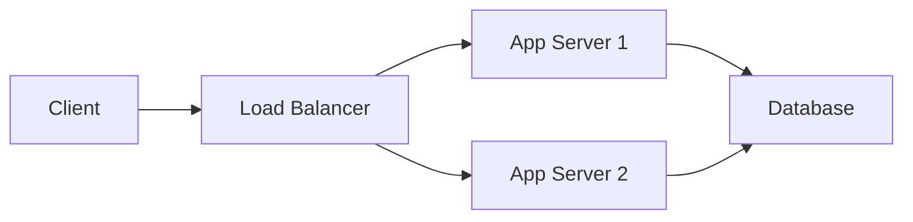

# Architecture Tools Reference

## Design & Diagramming

### 1. Diagrams as Code

**Mermaid**:


**PlantUML**: Java-based, comprehensive

**C4 Model**: Context, Container, Component, Code

---

### 2. Architecture Decision Records (ADRs)

**Template**:
```markdown
# ADR-001: Use PostgreSQL for primary database

## Status
Accepted

## Context
Need relational database for transactions.

## Decision
Use PostgreSQL 15 with streaming replication.

## Consequences
- ACID guarantees
- Mature ecosystem
- Requires scaling strategy
```

---

## Capacity Planning

### 1. Load Testing

**Apache JMeter**: GUI-based load testing
**Gatling**: Code-based, Scala/Java
**k6**: Modern, JavaScript-based

**Example (k6)**:
```javascript
import http from 'k6/http';
import { sleep, check } from 'k6';

export let options = {
  stages: [
    { duration: '2m', target: 100 }, // Ramp up
    { duration: '5m', target: 1000 }, // Stay at peak
    { duration: '2m', target: 0 }, // Ramp down
  ],
};

export default function () {
  let res = http.get('https://api.example.com/users');
  check(res, {
    'status is 200': (r) => r.status === 200,
    'response time < 200ms': (r) => r.timings.duration < 200,
  });
  sleep(1);
}
```

---

### 2. Capacity Calculators

**Little's Law**: L = λW
- L: Average items in system
- λ: Arrival rate
- W: Average time in system

**Example**:
```
Target: 10,000 RPS
Average latency: 100ms

Concurrent connections = 10,000 * 0.1 = 1,000
Servers needed (200 conn/server) = 1,000 / 200 = 5 servers
```

---

## Observability

### Metrics (Prometheus + Grafana)
### Logging (ELK, Loki)
### Tracing (Jaeger, Zipkin)

---

## Infrastructure as Code

**Terraform**: Multi-cloud provisioning
**Pulumi**: TypeScript/Python IaC
**AWS CDK**: TypeScript for AWS

---

## API Design

**OpenAPI (Swagger)**: REST API specs
**gRPC**: High-performance RPC
**GraphQL**: Flexible queries
