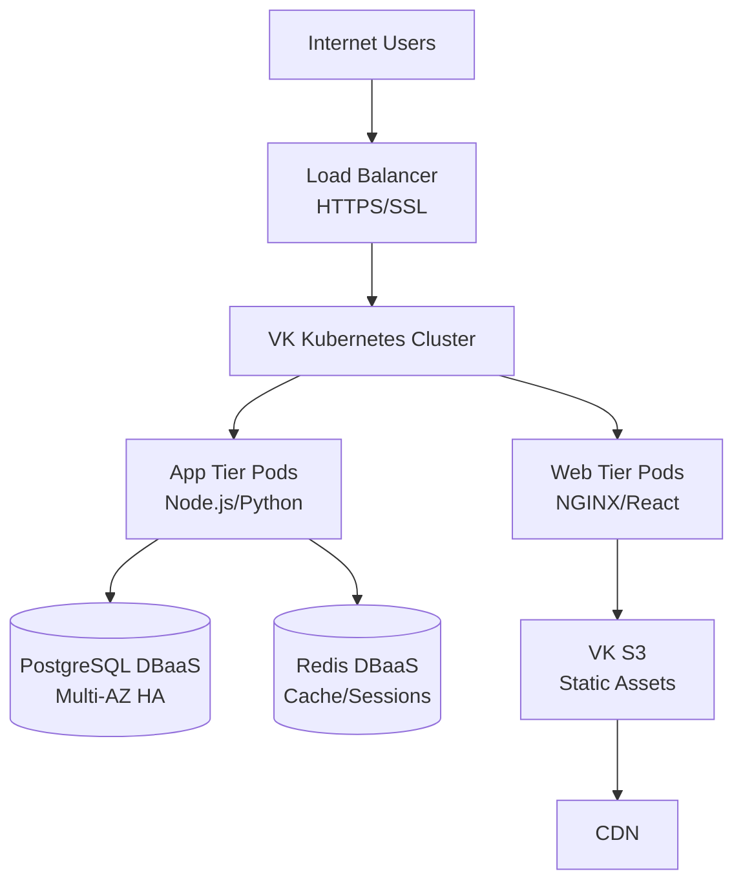
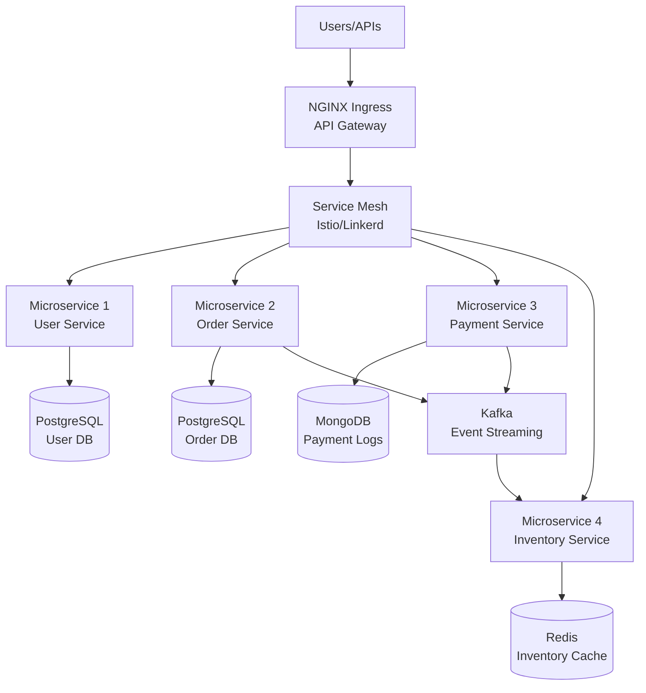
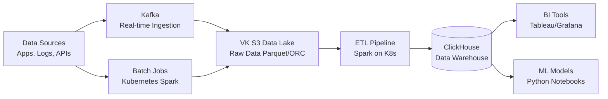
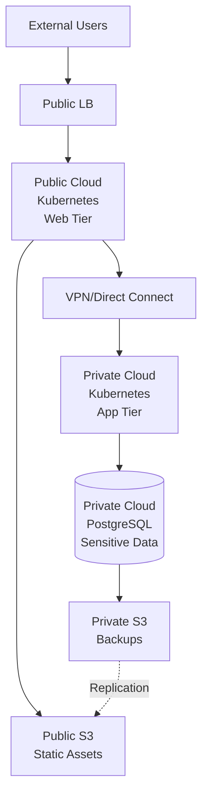
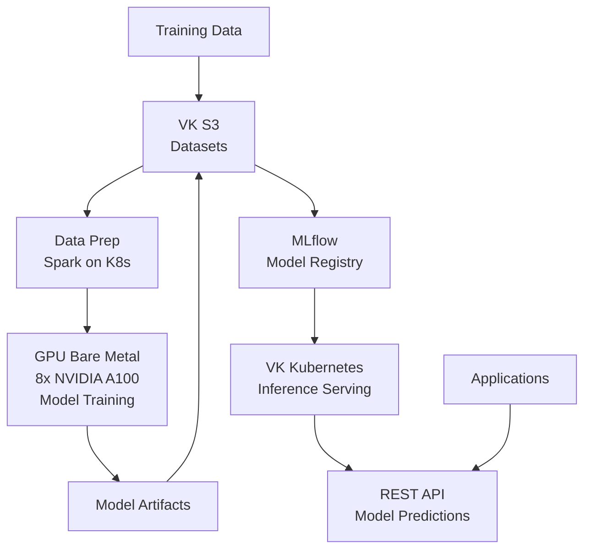
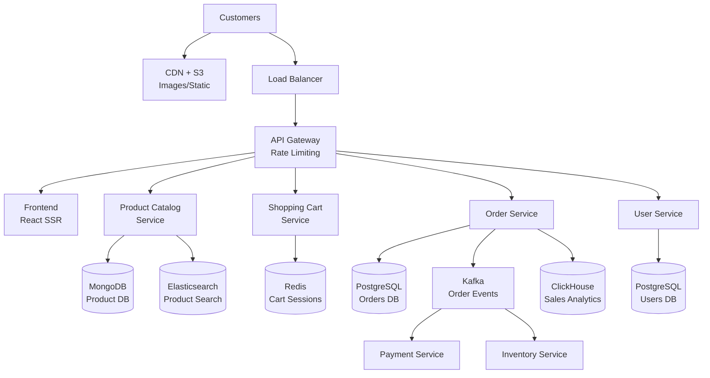
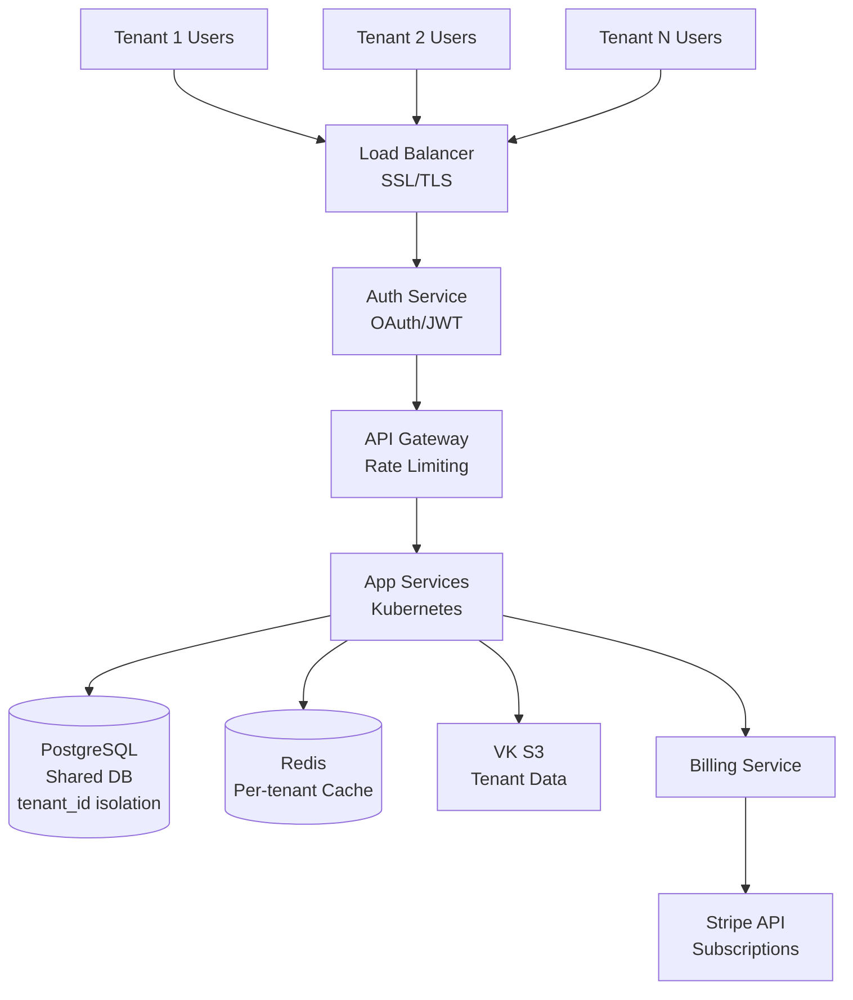

# VK Cloud Reference Architectures

## When to Use This Skill

- Designing cloud solutions for common use cases
- Accelerating proposal development with proven patterns
- Demonstrating VK Cloud capabilities to customers
- Avoiding architectural anti-patterns
- Estimating sizing and costs for standard workloads
- Creating architecture diagrams for proposals

## Architecture Principles

All reference architectures follow these principles:

1. **High Availability**: Multi-AZ deployment with automatic failover
2. **Scalability**: Auto-scaling for compute and horizontal scaling for data
3. **Security**: Defense in depth, encryption at rest/transit, least privilege
4. **Cost Optimization**: Right-sized instances, auto-scaling, reserved instances
5. **Operational Excellence**: Monitoring, logging, automated backups
6. **Cloud-Native**: Kubernetes, immutable infrastructure, declarative config
7. **Data Sovereignty**: All data in Russian data centers (152-FZ compliance)
8. **No Vendor Lock-In**: Open standards (K8s, S3, PostgreSQL) for portability

---

## Reference Architecture 1: Three-Tier Web Application

**Use Case**: Traditional web applications (e-commerce, SaaS, CMS, portals)

**Components**:
- **Web Tier**: NGINX or Apache on Kubernetes (auto-scaling)
- **Application Tier**: Node.js/Python/Java microservices on Kubernetes
- **Data Tier**: PostgreSQL DBaaS (HA configuration)
- **Caching**: Redis DBaaS for session storage and caching
- **Storage**: VK S3 for static assets (images, CSS, JS)
- **CDN**: Integrated with VK S3 for content delivery
- **Load Balancer**: Layer 7 LB with SSL termination

**Architecture Diagram** (Mermaid):

**Sizing Example** (Medium scale: 10K concurrent users):
- Kubernetes: 6 worker nodes (gp.medium: 2 vCPU, 4 GB RAM)
- PostgreSQL: gp.large (4 vCPU, 16 GB RAM, 500 GB storage)
- Redis: 8 GB RAM
- VK S3: 500 GB storage
- Load Balancer: 1x Layer 7 LB

**Estimated Cost**: ~₽80,000/mo

**High Availability**:
- Load balancer health checks with auto-recovery
- Kubernetes auto-healing and horizontal pod autoscaler
- PostgreSQL Multi-AZ with automatic failover
- Redis Sentinel for cache HA
- S3 with 99.999999999% durability

**Use Cases**:
- E-commerce platforms (product catalogs, shopping carts)
- SaaS applications (CRM, project management)
- Content management systems (WordPress, Drupal)
- Web portals (intranets, customer portals)

---

## Reference Architecture 2: Microservices on Kubernetes

**Use Case**: Cloud-native microservices architectures

**Components**:
- **API Gateway**: NGINX Ingress Controller or Kong
- **Microservices**: 10-50 microservices deployed as Kubernetes deployments
- **Service Mesh**: Istio or Linkerd for service-to-service communication
- **Databases**: PostgreSQL DBaaS + MongoDB DBaaS (polyglot persistence)
- **Message Queue**: Kafka (VK Data Platform) for async communication
- **Monitoring**: Prometheus + Grafana (built-in with VK Kubernetes)
- **Logging**: ELK stack (Elasticsearch, Logstash, Kibana)
- **CI/CD**: GitLab (VK Dev Platform) with automated pipelines

**Architecture Diagram** (Mermaid):

**Sizing Example** (Medium scale: 20 microservices):
- Kubernetes: 10 worker nodes (mix of gp.medium and gp.large)
- PostgreSQL: 3 database instances (different schemas)
- MongoDB: 1 cluster (3 nodes)
- Redis: 8 GB RAM
- Kafka: 3-broker cluster
- GitLab: 1 instance

**Estimated Cost**: ~₽150,000/mo

**Key Patterns**:
- **API Gateway Pattern**: Single entry point for all clients
- **Service Discovery**: Kubernetes DNS for service-to-service communication
- **Circuit Breaker**: Istio or application-level (Hystrix, resilience4j)
- **Event-Driven**: Kafka for async inter-service communication
- **Database per Service**: Each microservice owns its data

**Use Cases**:
- Modern SaaS platforms
- Fintech applications (banking, payments)
- E-commerce platforms with complex domains
- IoT platforms with event processing

---

## Reference Architecture 3: Data Lake & Analytics Platform

**Use Case**: Big data analytics, BI, machine learning pipelines

**Components**:
- **Data Lake**: VK S3 (store raw data in Parquet/ORC format)
- **Data Ingestion**: Kafka for real-time ingestion, batch jobs for historical data
- **ETL/Data Processing**: Kubernetes running Apache Spark or Dask
- **Data Warehouse**: ClickHouse (VK Data Platform) for OLAP queries
- **BI Tools**: Tableau, Power BI, or Grafana connected to ClickHouse
- **Data Catalog**: Metadata management (Apache Atlas or custom)
- **Orchestration**: Apache Airflow on Kubernetes for workflow management

**Architecture Diagram** (Mermaid):

**Sizing Example** (100 TB data, 1M events/day):
- VK S3: 100 TB storage (Cold tier for archival data)
- Kafka: 6-broker cluster (high throughput)
- Kubernetes: 20 worker nodes (cpu.large for Spark jobs)
- ClickHouse: 12-node cluster (2 TB per node)
- Airflow: 2 VMs (scheduler + workers)

**Estimated Cost**: ~₽400,000/mo

**Data Flow**:
1. **Ingestion**: Kafka streams real-time events, batch jobs load historical data
2. **Storage**: Raw data lands in S3 (immutable, partitioned by date)
3. **Processing**: Spark jobs transform raw data (cleaning, aggregation, enrichment)
4. **Warehousing**: Transformed data loaded into ClickHouse for fast queries
5. **Analytics**: BI tools query ClickHouse for dashboards and reports

**Use Cases**:
- Business intelligence and reporting
- Real-time analytics dashboards
- Machine learning feature engineering
- Log analytics and security monitoring
- IoT sensor data analytics

---

## Reference Architecture 4: Hybrid Cloud (Private + Public)

**Use Case**: Enterprises with on-premises investments or compliance requirements

**Components**:
- **VK Private Cloud**: Dedicated infrastructure for sensitive/regulated workloads
- **VK Public Cloud**: Shared infrastructure for scalable web tier and dev/test
- **Connectivity**: VPN or Direct Connect for secure hybrid connectivity
- **Data Sync**: S3 replication between private and public clouds
- **Unified Management**: Single control plane for both environments
- **Hybrid Kubernetes**: Kubernetes clusters in both private and public

**Architecture Diagram** (Mermaid):

**Sizing Example**:
- **Private Cloud**: 10 dedicated bare metal servers (databases, core apps)
- **Public Cloud**: 10 VMs for web tier, dev/test environments
- **VPN**: 1 Gbps site-to-site VPN
- **S3**: 10 TB in private, 5 TB in public

**Estimated Cost**: ~₽500,000/mo (private cloud custom pricing)

**Connectivity Options**:
1. **VPN (IPsec)**: Encrypted tunnel over internet (~₽3,000/mo)
2. **Direct Connect**: Dedicated fiber link (~₽50,000/mo for 1 Gbps)

**Data Placement Strategy**:
- **Private Cloud**: Customer data, financial records, PII (regulated)
- **Public Cloud**: Public-facing web tier, dev/test, analytics
- **Data Sync**: Replicate backups and non-sensitive data to public for DR

**Use Cases**:
- Banking and financial services (regulatory compliance)
- Healthcare (patient data must stay on-premises)
- Government (classified data in private cloud)
- Gradual cloud migration (on-prem → private cloud → public cloud)

---

## Reference Architecture 5: AI/ML Training & Inference Platform

**Use Case**: Machine learning model training and serving

**Components**:
- **Training**: Bare Metal GPU servers (NVIDIA A100) for model training
- **Data Preparation**: Kubernetes with Apache Spark/Dask for data preprocessing
- **Model Storage**: VK S3 for datasets and trained model artifacts
- **Model Registry**: MLflow or custom registry for model versioning
- **Inference Serving**: Kubernetes with TensorFlow Serving or PyTorch Serve
- **Auto-Scaling**: Horizontal pod autoscaler for inference endpoints
- **Monitoring**: Prometheus for model performance metrics (latency, throughput, accuracy)

**Architecture Diagram** (Mermaid):

**Sizing Example** (Medium ML workload):
- **Training**: 2x GPU Bare Metal (8x NVIDIA A100 each)
- **Data Prep**: Kubernetes with 10 worker nodes (cpu.large)
- **Inference**: Kubernetes with 5 GPU instances (gpu.small: NVIDIA T4)
- **S3**: 50 TB for datasets and models
- **MLflow**: 2 VMs for model registry

**Estimated Cost**: ~₽1,200,000/mo (GPU bare metal is expensive)

**Workflow**:
1. **Data Preparation**: Spark jobs clean and transform raw data
2. **Training**: Distributed training on GPU bare metal (PyTorch, TensorFlow)
3. **Model Registry**: Trained models versioned and stored in MLflow + S3
4. **Deployment**: Models deployed to Kubernetes as REST APIs
5. **Inference**: Applications call API endpoints for predictions
6. **Monitoring**: Track model performance and retrain when accuracy degrades

**Use Cases**:
- Computer vision (image classification, object detection)
- Natural language processing (chatbots, sentiment analysis)
- Recommendation systems (e-commerce, media)
- Fraud detection (fintech)

---

## Reference Architecture 6: E-Commerce Platform

**Use Case**: Online retail platform with high traffic and transaction volume

**Components**:
- **Frontend**: React/Vue.js on Kubernetes (server-side rendering)
- **API Gateway**: NGINX Ingress with rate limiting and authentication
- **Microservices**: Product Catalog, Shopping Cart, Order, Payment, User Management
- **Databases**: PostgreSQL (orders, users), MongoDB (product catalog)
- **Search**: Elasticsearch for product search
- **Cache**: Redis for shopping cart sessions and product cache
- **Message Queue**: Kafka for order processing events
- **Payment Gateway**: Integration with Stripe/PayPal (external)
- **CDN**: VK S3 + CDN for product images
- **Analytics**: ClickHouse for sales analytics and reporting

**Architecture Diagram** (Mermaid):

**Sizing Example** (High traffic: 100K daily users, 5K transactions/day):
- Kubernetes: 20 worker nodes (gp.large)
- PostgreSQL: 2 clusters (orders, users), each gp.xlarge (8 vCPU, 32 GB)
- MongoDB: 6-node cluster for product catalog
- Redis: 16 GB RAM for cart sessions
- Elasticsearch: 6-node cluster for product search
- Kafka: 3-broker cluster
- ClickHouse: 6-node cluster for analytics
- VK S3: 5 TB for product images

**Estimated Cost**: ~₽350,000/mo

**Key Features**:
- **High Availability**: Multi-AZ deployment, auto-scaling, circuit breakers
- **Performance**: Redis caching reduces database load by 80%
- **Search**: Elasticsearch provides subsecond product search
- **Event-Driven**: Kafka decouples order processing (async payment, inventory)
- **Analytics**: ClickHouse real-time sales dashboards for business
- **Security**: PCI-DSS compliance for payment data (tokenization)

**Use Cases**:
- Online retail (fashion, electronics, groceries)
- B2B e-commerce (wholesale, distributors)
- Marketplace platforms (multi-vendor)

---

## Reference Architecture 7: SaaS Multi-Tenant Application

**Use Case**: SaaS platforms with thousands of customers (tenants)

**Components**:
- **Multi-Tenancy**: Shared infrastructure with tenant isolation
- **Tenant Database Strategy**: Shared database with tenant_id column
- **Authentication**: OAuth 2.0 + JWT for API access
- **Billing**: Integration with Stripe/Chargebee for subscription management
- **Kubernetes**: Microservices with horizontal pod autoscaling
- **API Rate Limiting**: Per-tenant rate limits (prevent abuse)
- **Monitoring**: Per-tenant metrics and usage tracking

**Architecture Diagram** (Mermaid):

**Multi-Tenancy Strategies**:
1. **Shared Database, Shared Schema**: Single database with `tenant_id` column (most cost-effective)
2. **Shared Database, Separate Schema**: PostgreSQL schemas per tenant (better isolation)
3. **Separate Databases**: One database per tenant (highest isolation, highest cost)

**Recommendation**: Shared database with `tenant_id` for most SaaS (scales to 1000s of tenants)

**Sizing Example** (1000 tenants, 50K total users):
- Kubernetes: 15 worker nodes (gp.large)
- PostgreSQL: gp.xlarge (8 vCPU, 64 GB, 2 TB storage)
- Redis: 16 GB RAM (per-tenant cache keys)
- VK S3: 10 TB (tenant file storage)

**Estimated Cost**: ~₽200,000/mo

**Key Features**:
- **Tenant Isolation**: Application-level isolation with `tenant_id` in all queries
- **Rate Limiting**: Per-tenant API quotas (prevent one tenant from DDoSing platform)
- **Usage Tracking**: Meter API calls, storage, compute for billing
- **Billing Integration**: Automated subscription management with Stripe
- **Onboarding**: Self-service signup and tenant provisioning

**Use Cases**:
- SaaS CRM (Salesforce-like)
- Project management (Jira, Asana-like)
- Marketing automation (HubSpot-like)
- HR systems (BambooHR-like)

---

## Cost Estimation Guide

**Small Scale** (Startup, <1K users):
- Compute: 2-4 VMs or K8s nodes
- Database: Small DBaaS instance
- Storage: <500 GB S3
- **Cost**: ₽20,000-50,000/mo

**Medium Scale** (Growth, 1K-100K users):
- Compute: 5-15 VMs or K8s nodes
- Database: Medium DBaaS with HA
- Storage: 1-10 TB S3
- **Cost**: ₽80,000-250,000/mo

**Large Scale** (Enterprise, >100K users):
- Compute: 20-50+ VMs or K8s nodes
- Database: Large DBaaS clusters, sharding
- Storage: 10-100 TB S3
- **Cost**: ₽300,000-1,000,000+/mo

**Cost Optimization Tips**:
- Use reserved instances for steady-state workloads (20-40% savings)
- Auto-scaling to match demand (30-50% savings on variable workloads)
- S3 lifecycle policies (move cold data to archive, 60-80% savings)
- Right-size instances (eliminate over-provisioned resources)

---

## Key Takeaways

1. **Start with Reference Architecture**: Adapt proven patterns to customer requirements
2. **Design for HA**: Always multi-AZ databases, load balancers, auto-scaling
3. **Security by Default**: Encryption, network isolation, least privilege
4. **Cost Optimize**: Right-size, auto-scale, reserved instances, S3 lifecycle
5. **Monitor Everything**: Prometheus, Grafana, logging, alerting
6. **Plan for Scale**: Design for 10x growth (horizontal scaling, sharding)
7. **Data Sovereignty**: All data in Russia (152-FZ compliance)
8. **No Lock-In**: Use Kubernetes, S3 API, PostgreSQL (portable)

Use these reference architectures as starting points—customize based on customer requirements, constraints, and scale.
